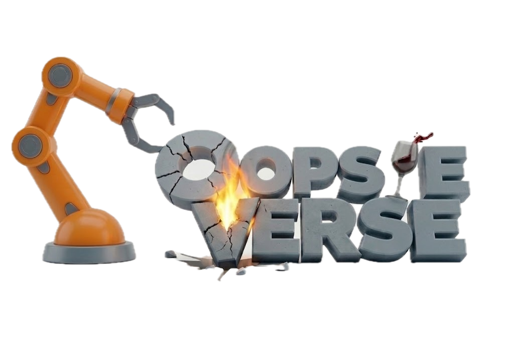
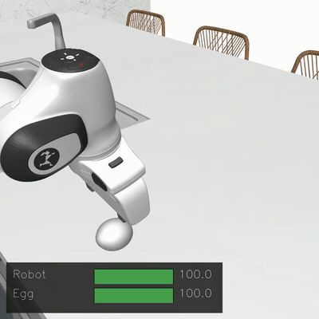
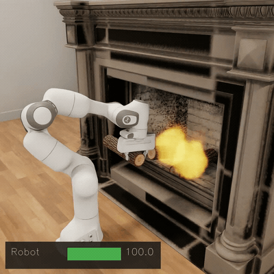
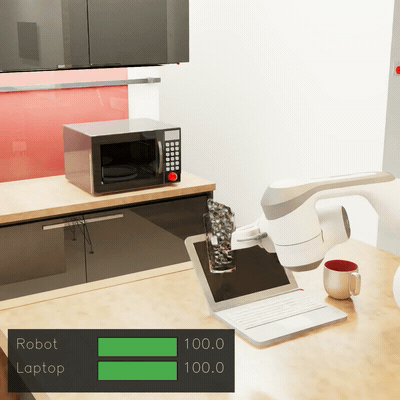

<p align="center">
  
</p>

<p align="center">
  
  &nbsp;
  
  &nbsp;
  
</p>

<h3>
  <b>This is the official codebase for OopsieVerse, a damage-aware, simulator-agnostic framework and benchmark for learning and evaluating safer robot manipulation. Please follow the documentation for getting started.</b>
</h3>

<p align="center">
  <font size="5">
    <a href="https://robin-lab.cs.utexas.edu/oopsieverse/"><b>🌐 Website</b></a>
    &nbsp;·&nbsp;
    <a href="https://robin-lab.cs.utexas.edu/oopsieverse/static/pdfs/oopsieverse.pdf"><b>📄 Paper</b></a>
    &nbsp;·&nbsp;
    <a href="https://ut-austin-robin.github.io/oopsieverse/documentation/"><b>📚 Documentation</b></a>
  </font>
</p>

## Citation

If you use OopsieVerse in your research, please cite:

```bibtex
@inproceedings{balaji2026oopsieverse,
  title={OopsieVerse: A Safety Benchmark with Damage-Aware Simulation for Robot Manipulation},
  author={Balaji, Arnav and Bahety, Arpit and Ambatipudi, Sriniket and Lam, Daniel and Xu, Junhong and Mart{\'\i}n-Mart{\'\i}n, Roberto},
  booktitle={Robotics: Science and Systems (RSS), 2026},
  year={2026}
}
```

## Acknowledgements

OopsieVerse builds on [BEHAVIOR-1K / OmniGibson](https://behavior.stanford.edu/), [RoboCasa](https://robocasa.ai/), and [RoboSuite](https://robosuite.ai/).
